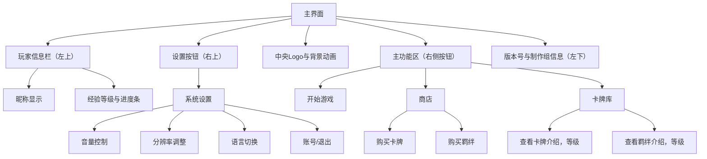
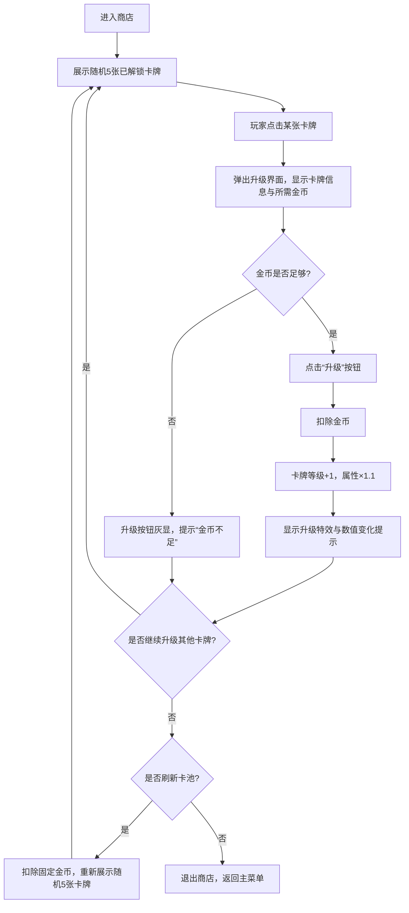
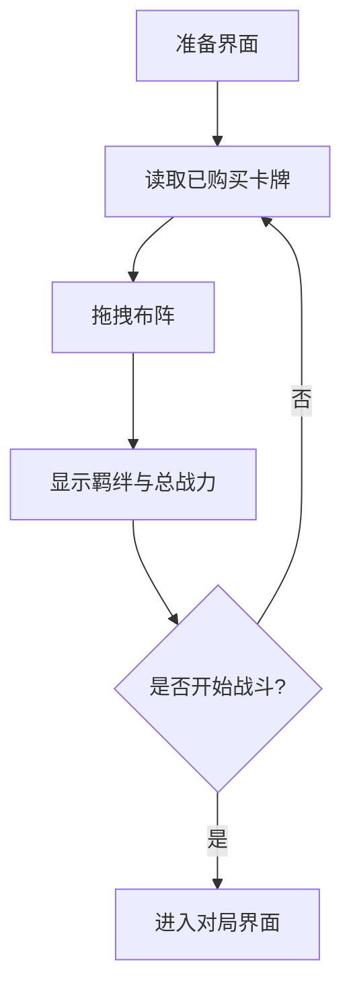
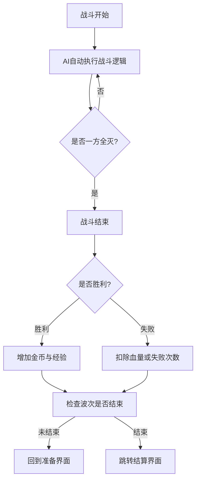
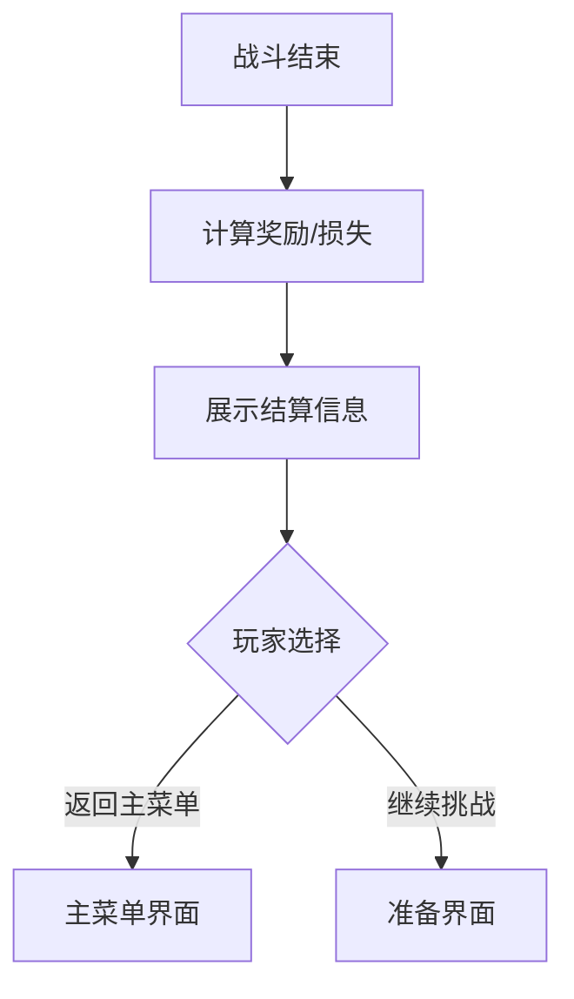

# 🎮 Hex Arena: Auto Chess —— 游戏策划案

## 1. 游戏概述

### 1.1 游戏名称与运行环境
- **游戏名称**：Hex Arena: Auto Chess  
- **运行环境**：  
  - 平台：PC（Windows/Mac）、移动端（iOS/Android）  
  - 引擎：Unity 3D  
  - 硬件要求：中等配置及以上，支持触屏与鼠标操作  

---

### 1.2 游戏故事情节
在一个名为「赫克斯大陆」的奇幻世界，玩家将化身“棋术师”，通过召唤棋子英雄在六边形网格竞技场中展开战斗。  
故事主线围绕“永恒锦标赛”的展开，玩家需不断击败强敌、融合英雄，最终揭开大陆背后的远古秘密。

> 核心体验：策略布局 × 随机融合 × 成长探索

---

### 1.3 游戏特征
- 🟢 **六边形网格竞技场**：增强战略深度与移动选择。  
- 🟢 **拖拽升级机制**：三合一升星，操作直观。  
- 🟢 **角色融合系统**：跨种族/职业组合，解锁独特技能。  
- 🟢 **自动战斗系统**：战斗由棋子自动进行，玩家专注布阵与经济。  
- 🟢 **卡牌收集与构筑**：自由搭配卡组，形成独特策略体系。  

---

### 1.4 游戏定位
- **目标用户群**：策略游戏与自走棋爱好者（12~35岁）  
- **单局时长**：15–25 分钟  
- **主要玩法**：天梯模式、剧情关卡、随机事件探索  

---

### 1.5 游戏风格
- **画面风格**：Low-Poly 卡通渲染，强调棋盘与特效对比。  
- **音乐音效**：史诗氛围背景音乐 + 清晰战斗反馈音。  

---

## 2. 游戏机制

### 2.1 核心玩法与操作
**操作逻辑**
- 拖拽棋子放置到六边形格上  
- 有相同棋子自动进行合成升级（1→2→3星）  
- 可选择拖拽，将不同棋子融合（如“战士 + 法师 = 战斗法师”）  

**游戏阶段**
- **准备阶段**：购买棋子、布置阵型、融合升级  
- **战斗阶段**：自动战斗，可释放主动技能  

---

## 2.2 用户界面（UI）

本节展示整个游戏的用户界面设计，包括主菜单、准备界面、对局界面、商店、结算页面等，确保逻辑清晰、界面布局直观、交互流畅。

---

### 一、整体导航结构

- **总体布局**
  - **中央**：动态背景 + 游戏 Logo（循环播放动画或粒子特效）  
  - **左上角**：玩家信息栏  
    - 昵称（如“Alex”）  
    - 等级与经验条（以数字和进度条形式显示）  
  - **右上角**：设置按钮（⚙️ 图标）  
    - 点击打开系统设置面板，包括：  
      - 音量控制（BGM / SFX）  
      - 分辨率调整  
      - 语言切换  
      - 账号与退出选项  
  - **右侧主按钮区**：主要交互入口  
    - 🟢【开始游戏】 → 进入准备界面  
    - 🔵【商店】 → 购买卡牌与羁绊  
    - 🟣【卡牌库】 → 浏览与查看卡牌属性  
  - **左下角**：版本号与制作组信息（如 “v1.0.3 | TAI Studio”）

---

#### 主界面层级结构图（Mermaid）

**说明：** 
- 玩家从主菜单出发，可进入准备界面开始游戏； 
- 准备阶段可查看、购买单位并布置； 
- 战斗后跳转结算界面； 
- 商店与卡牌库可从主菜单访问。

---

### 二、商店界面设计

- **功能定位**  
  商店是玩家在关卡间进行强化与资源管理的核心界面。  
  玩家可使用金币购买「升级用卡牌」以提升己方整体等级，从而应对后续更高难度的关卡。  
  卡牌种类会随关卡进度自动解锁，无需额外购买或解锁。

---

- **布局结构**
  - **顶部**：显示玩家金币余额与刷新按钮（消耗固定金币刷新当前卡池）  
  - **中部**：卡池展示区（展示 5 张随机升级卡牌，每张卡牌附带：等级加成、价格、来源说明）  
  - **底部**：购买确认按钮与返回主菜单按钮  

---

- **核心交互逻辑**
  - 每次进入商店时，系统会根据当前关卡与玩家等级，自动生成 5 张不同品质的卡牌；  
  - 点击卡牌 → 弹出详细信息，包括：  
    - 提供的等级加成（乘数 ×1.1、×1.2 等）  
    - 购买所需金币  
    - 适用单位类型或效果描述；  
  - 购买卡牌 → 扣除金币并增加玩家等级值；  
  - 当等级提升后，玩家单位基础属性（生命值、攻击力、防御等）随之 ×1.1 递增；  
  - 若金币不足，购买按钮灰显不可点击；  
  - 可点击“刷新”按钮（消耗固定金币）重新生成卡池；  

---

---

### 三、准备界面设计

- **功能**：在正式对局前布置阵容、装备卡牌、查看羁绊。  
- **布局结构**
  - 左侧：准备区（最多 5 个候选格）；
  - 中央：缩小版战斗网格（用于布阵）；
  - 右侧：显示金币、羁绊信息、开始按钮。  

- **交互流程**
  1. 玩家从商店购买单位；
  2. 拖拽卡牌至战斗区布阵；
  3. 查看当前羁绊激活状态；
  4. 点击“开始战斗”按钮进入对局。

---

### 四、对局界面设计

- **功能定位**：核心自动战斗展示界面。  
- **布局结构**
  - 中央：六边形战斗网格（单位可见范围、攻击动画）
  - 左侧：准备区与卡槽（可观察替补单位）
  - 右侧：信息栏（金币、波数、敌方阵容、计时器）
  - 顶部：回合进度条
  - 底部：暂停、快进、退出按钮

---

### 五、结算界面设计

- **功能**：展示胜负、奖励与下一阶段选择。  
- **布局**
  - 中央：战斗结果（胜/负标志）
  - 左侧：金币、经验获取详情
  - 右侧：继续按钮 / 返回主菜单
  - 底部：历史记录统计  

---

### 六、设置界面设计

- **功能**
  - 音量调节（背景音乐/音效）
  - 分辨率调整
  - 游戏语言切换
  - 存档与读档选项
  - 退出游戏按钮

---

### 七、卡牌库界面

- **功能**
  - 展示所有已解锁卡牌；
  - 查看属性（血量、攻击力、技能、羁绊等）；
  - 可按羁绊类型或稀有度筛选；
  - 点击卡牌可查看立绘与技能动画预览。

---

### 八、UI视觉风格建议

- **整体基调**：轻奇幻风 + 现代科技感（如《云顶之弈》《合合骑兵》结合）
- **配色建议**：
  - 背景：深蓝或灰金系；
  - 战斗区：浅灰六边形格；
  - UI按钮：半透明蓝灰底 + 金色描边；
- **动效**：
  - 卡牌购买/刷新带轻微粒子动画；
  - 战斗胜利时闪光特效；
  - 羁绊激活时全局轻微光效提示。

---

## 3. 人工智能（AI）设计

### 3.1 棋子AI逻辑
- 根据职业决定目标与移动策略：  
  - 近战：攻击最近敌人  
  - 远程：优先高威胁目标  
  - 辅助：治疗或保护低血量友军  

### 3.2 AI难度层次
| 难度 | 特征 |
|-------|--------|
| 初级 | 随机行动 |
| 中级 | 基础策略移动 |
| 高级 | 模拟真实玩家行为 |

---

## 4. 游戏元素

### 4.1 角色系统

| 职业 | 性别 | 技能 | 描述 |
|------|------|------|------|
| 战士 | 男 | **旋风斩**：对周围敌人造成AOE伤害 | 高防御前排 |
| 法师 | 女 | **陨石术**：召唤陨石轰击范围敌人 | 魔法爆发 |
| 刺客 | 男 | **暗影突袭**：瞬移至敌后排攻击 | 高爆发脆皮 |
| 牧师 | 女 | **神圣之光**：为友军恢复生命 | 团队支援核心 |

---

### 4.2 物品系统
| 类型 | 功能 | 获得途径 |
|------|--------|------------|
| 装备 | 提升攻击、防御或附加效果 | 战斗掉落、商店购买 |
| 使用道具 | 如经验药水、融合石 | 任务或宝箱奖励 |
| 稀有物品 | 特殊融合素材 | 剧情事件或Boss掉落 |

---

### 4.3 场景与NPC
- **主场景**：六边形竞技场（含地形加成：高地增益、沼泽减速等）  
- **主要NPC**：  
  - 商店老板“老约翰”——提供棋子与融合服务  
  - 任务发布者“预言者艾露娜”——引导剧情线  

---

## 5. 故事背景

- **时代设定**：魔法与科技并存的「赫克斯大陆」  
- **核心冲突**：七大势力围绕“永恒之冠”展开争夺  
- **角色背景**：棋子英雄来自不同种族（人类、精灵、机械、暗影、元素）  
- **剧情目标**：成为锦标赛冠军，揭开棋术之源的真相  

---

## 6. 游戏流程（战斗节奏与回合机制）

### 6.1 回合与波次设定
- **每局时长**：约 10 分钟  
- **总波数**：共 6 波敌人  
- **节奏划分**：
  - 每波开始前进入 **准备阶段（Preparation Phase）**
  - 每波开始后进入 **战斗阶段（Battle Phase）**
  - 战斗阶段结束后结算奖励，进入下一轮准备  

---

### 6.2 准备阶段（Preparation Phase）

> 玩家进行策略决策与布阵操作的关键时段。

**核心机制**：
- **时间长度**：约 20~30 秒（后期波次略缩短至 15 秒）
- **金币与卡牌刷新**：
  - 每波开始时，玩家将获得一笔 **基础圣水**
  - 同时系统会提供 **3 张随机卡牌**（单位或装备）
- **玩家可进行以下操作**：
  1. **选择一张卡牌** 添加至：
     - 战场（若未达人数上限）
     - 或者候选台（Bench）
  2. **拖拽合成**：相同单位可拖拽合成为更高等级（例如 3→1 合成）
  3. **出售单位**：获得部分圣水返还，用于下一轮招募
  4. **重新刷新卡池**（消耗圣水，选项）

---

### 6.3 战斗阶段（Battle Phase）

> 自动战斗阶段，玩家无需操作，系统自动结算战斗结果。

- 玩家布置的单位自动与敌方AI（或其他玩家阵容）交战  
- 战斗采用 **自动寻敌 + 技能释放机制**
- 每波结束后：
  - 胜利：获得额外金币奖励与经验加成  
  - 失败：扣除生命值（例如总生命 3 次）  

---

### 6.4 单位上限机制（Population Cap）

- 每一波允许上阵的单位数量有限：  
  - **第 1 波**：可上阵 2 名单位  
  - **第 k 波**：可上阵 1 + k 名单位  
  - **第 6 波及之后**：最多可上阵 6 名单位  

> 此设计使玩家在前期必须精挑细选核心单位，后期逐渐形成完整阵容，实现策略递进。

---

### 6.5 波次节奏与奖励机制

| 波次 | 上阵人数上限 | 奖励圣水 | 敌方难度 | 备注 |
|:----:|:-------------:|:---------:|:----------:|:------:|
| 第1波 | 2 | +5 | 简单 | 新手教学或低AI |
| 第2波 | 3 | +6 | 普通 | 开始需要初步合成 |
| 第3波 | 4 | +7 | 普通+ | 战术成型阶段 |
| 第4波 | 5 | +8 | 困难 | 敌人开始带技能 |
| 第5波 | 6 | +9 | 困难+ | 核心阵容检验 |
| 第6波 | 6 | +10 | Boss | 最终决战 |

> 每一波奖励金币可用于强化后续卡组，后期策略的灵活度显著提高。

---

### 6.6 胜负判定
- 成功击败全部 6 波敌人 → **胜利**，结算评分与奖励  
- 生命值归零（例如累计 3 次失败）→ **游戏结束**  
- 根据波次推进情况显示称号（如「初露锋芒」「战场统帅」「完美胜者」）

---

## 7. 技术实现与AI系统

| 技术模块 | 实现方式 |
|-----------|------------|
| 图像渲染 | Unity URP（通用渲染管线），支持多平台优化 |
| AI逻辑 | 行为树（Behavior Tree）实现棋子战斗逻辑 |
| 路径规划 | 六边形A*寻路算法 |
| 网络对战 | 帧同步与服务器校验机制 |
| 安全策略 | 数据加密与反外挂验证 |

---

## 8. 卡牌设计系统（Card System Design）

### 8.1 基础属性（Core Attributes）

每张角色卡牌代表一名可上阵单位，拥有以下核心战斗特征：

| 属性名称 | 说明 | 示例数值 |
|:----------|:------|:-----------|
| **名称 (Name)** | 单位名称或称号 | 骑士·莱恩 |
| **稀有度 (Rarity)** | 影响获取概率与成长潜力（普通/稀有/史诗/传说） | 稀有 |
| **星级 (Star Level)** | 通过合成提升（最高3星） | ★★ |
| **生命值 (HP)** | 单位可承受的伤害总量 | 800 |
| **攻击力 (ATK)** | 单位每次攻击造成的基础伤害 | 120 |
| **攻击间隔 (Attack Interval)** | 两次普通攻击的时间间隔（秒） | 1.2s |
| **攻击距离 (Range)** | 攻击可覆盖的格数（近战为1格） | 1 |
| **攻击类型 (Attack Type)** | 近战 / 远程 / 魔法 / 投射物 | 近战 |
| **是否AOE (AOE)** | 是否为范围伤害技能 | 否 |
| **溅射范围 (Splash Radius)** | 若为AOE单位，表示影响半径 | — |
| **技能 (Skill)** | 主动或被动技能效果描述 | 释放护盾，减伤30% |
| **移动速度 (Move Speed)** | 单位在战场上的位移速度 | 1.0 单位/秒 |
| **攻击优先级 (Target Priority)** | 优先攻击目标类型（最近 / 血量最低 / 后排） | 最近 |
| **职业 (Class)** | 用于构建职业羁绊 | 战士 |
| **种族 (Race)** | 用于构建种族羁绊 | 人族 |
| **阵营 (Faction)** | 阵营加成或对立系统（可选） | 光明阵营 |
| **成长系数 (Growth Coeff.)** | 星级提升带来的全属性成长比例 | +50% 全属性/星 |
| **经济价值 (Sell Value)** | 出售获得金币数量 | 2 金币 |

> 小结：以上属性确保单位具备完整的可调性与平衡空间，适合未来进行公式化数值平衡或神经进化调整。

---

### 8.2 羁绊系统（Synergy System）

> 羁绊是玩家构建阵容的战略核心。通过在战场上部署特定组合的种族/职业单位，激活额外的团队增益。

#### (1) 羁绊分类

- **种族羁绊（Race Synergy）**
  - 强调天然特性与抗性  
  - 示例：
    - **人族**：全体单位生命 +10%
    - **兽族**：攻击力 +15%
    - **机械族**：获得持续生命回复
    - **暗影族**：首次死亡时复活一次（冷却120秒）

- **职业羁绊（Class Synergy）**
  - 强调战术定位与角色分工  
  - 示例：
    - **战士**：全体护甲 +20%
    - **射手**：攻击距离 +1，暴击率 +10%
    - **法师**：技能伤害 +25%
    - **辅助**：全体生命回复速度 +15%

#### (2) 羁绊激活条件
- 同类单位达到指定数量时自动生效：  
  - 2名 → 一级羁绊  
  - 4名 → 二级羁绊  
  - 6名 → 三级羁绊  

> 玩家需要在“短局制时间限制”内平衡 **单卡强度** 与 **羁绊策略深度**。

---

### 8.3 随机事件系统（Random Event System）

> 为提高重玩性与策略变化，每轮准备阶段可随机触发事件。

| 事件类型 | 说明 | 示例效果 |
|:-----------|:------|:-----------|
| **圣水暴击 (Gold Bonus)** | 获得额外圣水 | +5 圣水 |
| **幸运刷新 (Lucky Reroll)** | 卡牌池额外刷新 1 次 | 免费刷新一次 |
| **属性强化 (Stat Boost)** | 随机提升场上某一单位的属性 | +10% 攻击力 |
| **羁绊强化 (Synergy Surge)** | 临时提升所有羁绊效果一级（持续一波） | 战士羁绊+1级 |
| **危险预兆 (Risk Event)** | 下一波敌人强度+10%，但胜利奖励翻倍 | 双倍圣水奖励 |
| **装备掉落 (Loot Drop)** | 掉落一件随机装备，可赋予单位 | 例：攻击力+20% |

> 每场战斗最多触发 2~3 次事件，玩家需权衡风险与收益。

---

### 8.4 卡牌获取与刷新机制

- 每回合系统提供 **3 张随机卡牌**
- 卡池概率按稀有度加权：
  - 普通：60%
  - 稀有：30%
  - 史诗：8%
  - 传说：2%
- 可使用金币手动刷新（消耗 2 圣水）
- 通过击败 Boss 或完成特定事件可获得额外卡牌奖励

---

### 8.5 合成与成长机制

- **合成规则**：3 张相同单位 → 提升 1 星级  
- **星级成长**：
  - 属性全面提升（HP, ATK, Skill强度 等）
  - 模型或特效升级（用于视觉反馈）
- **最高星级**：3 星
- **成长公式示例**：

\[
Stat_{3★} = Stat_{1★} \times (1 + 0.5 \times (★-1))
\]

---

> 总结：卡牌系统通过属性、羁绊与事件三层逻辑构成了游戏的“策略循环”，在有限时间内迫使玩家进行博弈与抉择，形成高复玩性与紧凑节奏。

## 9. 系统扩展方向

### 9.1 金币系统（Economy）
- 胜利、连胜、出售棋子可获得金币  
- 使用金币购买棋子、刷新商店、升级等级  

### 9.2 羁绊系统（Synergy）
| 羁绊 | 触发条件 | 效果 |
|------|------------|--------|
| 人类 | 3/6人类单位 | 全体生命回复 +10% |
| 法师 | 3/6法师单位 | 法术伤害 +15% |
| 机械 | 2/4机械单位 | 召唤物耐久 +20% |

### 9.3 融合探索机制
- 某些特殊组合仅能在特定条件触发（如剧情或隐藏任务）  
- 鼓励玩家实验与探索未知组合  

---

## 10. 宣传与视觉

### 10.1 宣传语
> **“策略至上，融合无限！在六角棋盘上主宰战局！”**

### 10.2 片头动画构想
- 主角召唤棋子，镜头俯瞰六边形棋盘  
- 战斗中融合动画闪现，展示多职业合体的炫酷场景  
- 最后以“Hex Arena”Logo与火焰纹章收尾  

---

© 2025 Hex Studio. All Rights Reserved.
